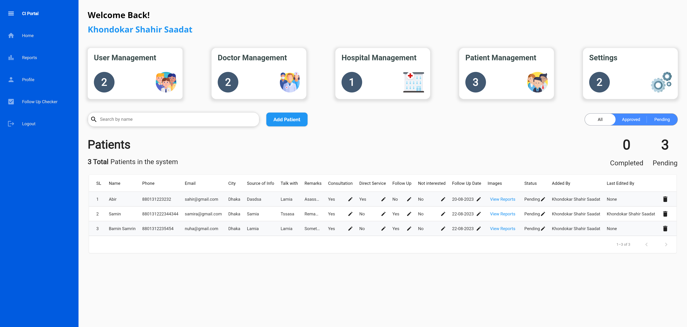

# Cikitsa-International-Portal

<h2>Overview 🌐</h2>
A comprehensive management portal designed for seamless user and hospital administration. The portal facilitates adding, managing, and overseeing both internal and external users, with dedicated features ensuring streamlined operations and instant data updates on the Cikitsa mobile app.

<h2>Key Features 🌟</h2>
<h3>User Management</h3> 
Efficiently add and oversee internal users with an intuitive interface.

<h3>Permission Control</h3>
Exclusive access for Super Admins to delegate feature permissions.

<h3>Doctor Onboarding</h3>
Simplified onboarding with multiple verification stages.

<h3>Hospital Administration</h3>
Integrate and manage hospitals with real-time updates on the Cikitsa app.

<h3>Patient Management</h3>
Streamline patient data and automate follow-up notifications.

<h3>Automated Email Notifications</h3>
Keep doctors updated post-onboarding.

<h3>Additional Features</h3>
A suite of supplementary tools to enhance user experience.

<h3>Integration with Cikitsa App 📱</h3>
Ensures real-time sync between the portal and the Cikitsa mobile application, reflecting all approved listings instantly.

<h2>Technology Stack 💻</h2> 
<h3>Frontend & Mobile</h3>
Developed using Flutter with Dart, offering a responsive, cross-platform experience.

<h3>Database 🗄️</h3>
Relies on Firebase Realtime Firestore and Database for data storage, ensuring instantaneous synchronization and scalability.

<h3>Email Service 📄</h3>
Uses backend(API) to send email to patients and doctors

<h2>App Screenshots</h2>

